# Redrob Intelligent Candidate Discovery & Ranking System

An intelligent, production-ready candidate retrieval and ranking system designed to match a pool of 100,000 candidates against a **Senior AI Engineer (Founding Team)** job description. The system executes in less than 3 minutes on CPU by leveraging a hybrid screening and caching architecture, ensuring offline reliability, high precision, and deterministic ordering.

---

## 🏆 Key Features

1. **Honeypot Shield (Inconsistency Filter)**:
   * Logical verification checks that flag and drop corrupt, suspicious, or gaming profiles (e.g., skill durations exceeding candidate years of experience, timeline anomalies, expert skills with zero duration).

2. **Multi-Factor Heuristic screening**:
   * Evaluates location preference (Noida/Pune preferred), experience fit (optimum 5-9 years of experience), core skill match weighted by proficiency and duration, python bonus, role title/headline contexts, and IT consulting services penalties (e.g., TCS/Infosys services filters).

3. **Dense Semantic Retrieval**:
   * Utilizes the `all-MiniLM-L6-v2` SentenceTransformer to project candidate profiles (headlines, summaries, skills, recent job descriptions) and Job Descriptions into a shared 384-dimensional vector space, computing Cosine Similarity.
   * Leverages precomputed NumPy embedding caches for sub-5 second warm runs, and automatically falls back to screening-based CPU encoding (top 1,000) for sub-15 second cold runs.

4. **Engagement & Availability Multipliers**:
   * Adjusts rankings dynamically using platform behavioral metrics: recruiter response rates/times, Github contribution scores, active recency, notice periods, and salary alignment.

5. **Hallucination-Free Reasoning Engine**:
   * Predefined semantic frames dynamically construct factual, rank-appropriate justifications without using text synthesizers, assuring 0% hallucination.

---

## ⚙️ System Workflow

The sequence of operations from input profiles to final ranked output is illustrated in the diagram below:

```mermaid
graph TD
    %% Define Styles
    classDef default fill:#F4F6F9,stroke:#334E68,stroke-width:2px,color:#102A43;
    classDef startEnd fill:#E2E8F0,stroke:#475569,stroke-width:3px,color:#0F172A;
    classDef filter fill:#FEE2E2,stroke:#EF4444,stroke-width:2px,color:#991B1B;
    classDef heuristic fill:#FEF3C7,stroke:#D97706,stroke-width:2px,color:#78350F;
    classDef cache fill:#ECFDF5,stroke:#059669,stroke-width:2px,color:#065F46;
    classDef semantic fill:#E0F2FE,stroke:#0284C7,stroke-width:2px,color:#075985;
    classDef output fill:#F3E8FF,stroke:#7C3AED,stroke-width:2px,color:#5B21B6;

    %% Nodes
    Start([Start: CLI Execution / CI Pipeline]):::startEnd
    LoadData[Load Candidate Profiles JSONL & Job Description JD]
    
    subgraph "Honeypot Screening"
        CheckHoneypot{Honeypot Filter:<br/>Inconsistent profile?}:::filter
        DropCand[Drop Candidate / Assign Score 0.0]:::filter
    end

    subgraph "Heuristic Pre-Scoring"
        CalcHeuristic[Calculate Heuristic Score:<br/>1. Experience Fit 35%<br/>2. Location Preference 15%<br/>3. Skill Weighting 30%<br/>4. Role Title Fit 20%<br/>5. Consulting Firm Penalty 0.5x/0.8x]:::heuristic
    end

    subgraph "Embedding / Semantic Retrieval Route"
        CheckCache{Precomputed Cache Available<br/>for all clean Candidate IDs?}:::cache
        
        %% Fast Path
        LoadCache[Load Precomputed embeddings from candidate_embeddings.npy]:::cache
        
        %% On-the-Fly Path
        SortHeur[Sort by Heuristic Score desc]:::heuristic
        Truncate[Select Top 1,000 Candidates]:::heuristic
        LoadModel[Load Cached all-MiniLM-L6-v2 Model]:::semantic
        Inference[Encode Top 1,000 Candidate Profiles on CPU]:::semantic
    end

    subgraph "Similarity and Score Compilation"
        EncodeJD[Encode Job Description Text]:::semantic
        CosSim[Compute Cosine Similarity between embeddings]:::semantic
        CompScore[Combine Scores:<br/>0.60 * Cosine Similarity + 0.40 * Heuristic Score]
        BehMult[Apply Behavioral Multipliers:<br/>open_to_work, response rate/time, active recency, notice period, max salary]
        SortTies[Deterministic Tie-Breaking Sort:<br/>1. Composite Score desc<br/>2. candidate_id asc]
    end

    subgraph "Output Generation"
        Reasoning[Generate Factual Dynamic Reasoning<br/>based on Ranks 1-10, 11-50, 51-100]
        WriteCSV[Write Top 100 Rows to submission.csv]:::output
        End([End: Valid Submission CSV File]):::startEnd
    end

    %% Relationships
    Start --> LoadData
    LoadData --> CheckHoneypot
    
    CheckHoneypot -->|Yes| DropCand
    CheckHoneypot -->|No| CalcHeuristic
    
    CalcHeuristic --> CheckCache
    
    CheckCache -->|Yes: Fast Path| LoadCache
    CheckCache -->|No: Fallback Path| SortHeur
    
    SortHeur --> Truncate
    Truncate --> LoadModel
    LoadModel --> Inference
    
    LoadCache --> EncodeJD
    Inference --> EncodeJD
    
    EncodeJD --> CosSim
    CosSim --> CompScore
    CompScore --> BehMult
    BehMult --> SortTies
    SortTies --> Reasoning
    Reasoning --> WriteCSV
    WriteCSV --> End

    %% Apply Classes
    class Start,End startEnd;
```



---

## 💻 Streamlit Sandbox App

An interactive dashboard is available to visualize rank results, filter candidates in real time, analyze distributions, inspect honeypot logs, and download compliant submission files:
* **Overview & Analytics**: KPI metrics card, Years of Experience (YoE) histograms, Candidate Location maps, and Score Correlation scatter charts.
* **Scored & Ranked Candidates**: Expandable cards displaying profile details, core skills badges, recruiting signals, scoring breakdown, and dynamic justifications.
* **Honeypot Log**: Inspects blocked spam accounts and provides audit logs on violated rules.

---

## 🛠️ Setup & Local Running

1. **Clone the repository**:
   ```bash
   git clone <repository_url>
   cd AI_Resume_Ranker
   ```

2. **Set up virtual environment & install dependencies**:
   ```bash
   python -m venv env
   # Windows
   env\Scripts\activate
   # Linux/macOS
   source env/bin/activate

   pip install -r requirements.txt
   ```

3. **Run the CLI Ranking Script**:
   * Using warm-cache (sub-5 seconds):
     ```bash
     python rank.py --candidates data/candidates.jsonl --out submission.csv
     ```
   * Running on raw/custom test data (sub-15 seconds):
     ```bash
     python rank.py --candidates data/first_200_candidates.jsonl --out test_submission.csv
     ```

4. **Launch Streamlit Dashboard Locally**:
   ```bash
   streamlit run app.py
   ```
