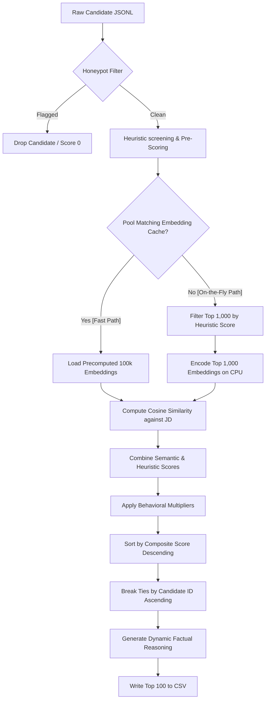
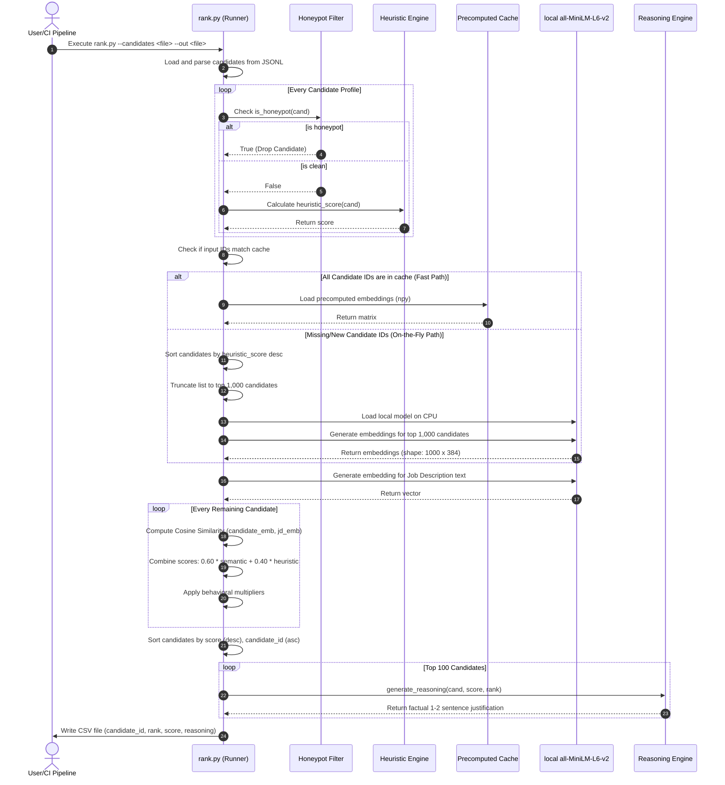
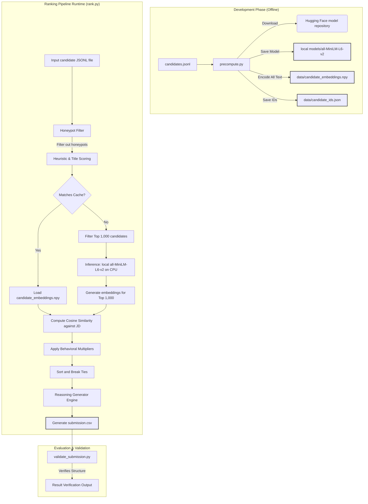

# Redrob Intelligent Candidate Discovery & Ranking System: System Design & QA Report

This document answers the core questions concerning the architecture, design choices, scoring mechanics, and implementation details of the candidate retrieval and ranking system.

---

## 1. Key Requirements from the Job Description (JD)

The system is tailored for a **Senior AI Engineer (Founding Team)** role at **Redrob AI**, a Series A AI-native talent intelligence platform. The key requirements and constraints extracted from the JD are:

*   **Experience Level**: Target of **5–9 years of professional experience** (evaluated as a measure of judgment, not a strict limit).
*   **Location**: Noida/Pune-preferred (hybrid, flexible cadence). Open to candidates willing to relocate from Tier-1 Indian cities. Visas are **not** sponsored, so candidates must already reside in India.
*   **Core Technical Skills (Mandatory)**:
    *   **Embeddings-based Retrieval**: Deployed production systems using SentenceTransformers, OpenAI embeddings, BGE, or E5, with experience handling embedding drift, index refreshes, and quality regressions.
    *   **Vector & Hybrid Search**: Production usage of Pinecone, Weaviate, Qdrant, Milvus, OpenSearch, Elasticsearch, or FAISS.
    *   **High-Quality Python**: Clean, production-ready code.
    *   **Evaluation Frameworks**: Rigorous design of ranking metrics, including NDCG, MRR, MAP, offline-to-online correlation, and A/B test interpretation.
*   **Nice-to-Haves**: LLM fine-tuning (LoRA, QLoRA, PEFT), learning-to-rank models (e.g., XGBoost-based or neural), distributed systems, and inference optimization.
*   **Critical Disqualifiers & Anti-Patterns**:
    *   **Consulting-Firm-Only Background**: Candidates who have worked *only* at large IT consulting services firms (e.g., TCS, Infosys, Wipro, Accenture, Cognizant, Capgemini) are disqualified.
    *   **Pure Researchers**: Profiles with academic-only or research-only backgrounds lacking production deployment experience.
    *   **OpenAI Wrapper Developers**: Recent AI experience consisting solely of calling APIs with LangChain without pre-LLM ML experience.
    *   **Non-Coding Seniors**: Architects or leads who have not written production code in the last 18 months.
    *   **Keyword Stuffers**: Candidates listing many high-level AI keywords (e.g., RAG, Milvus) in their skills sections, but whose career histories or titles (e.g., Marketing Manager, Accountant) indicate they have never applied them.

---

## 2. Relevant Candidate Signals & Evaluating Fit Beyond Keyword Matching

### 2.1 Relevance Signals
To build a holistic view of candidate availability, fit, and intent, we evaluate two categories of signals:

1.  **Professional Qualifications**: Years of experience, job titles, technical skills, skill proficiencies, and career descriptions.
2.  **Platform Behavioral Signals**: 
    *   `open_to_work_flag` (Direct intent to change jobs).
    *   `recruiter_response_rate` & `avg_response_time_hours` (Communication engagement).
    *   `last_active_date` (Recency of platform activity; proxy for active candidate status).
    *   `github_activity_score` (Technical contribution volume).
    *   `notice_period_days` (Availability speed).
    *   `expected_salary_range_inr_lpa` (Budget alignment).

### 2.2 Evaluating Fit Beyond Keyword Matching
Standard keyword matching falls prey to "keyword stuffers" who add buzzwords to their skills list. Our solution bypasses this through four layers:

*   **Heuristic Cross-Referencing**: We scan the free-text description fields of historical roles in `career_history` for matching keywords. A candidate who lists "Pinecone" under skills but has never mentioned search, retrieval, indexing, or vector pipelines in their career descriptions receives a lower score.
*   **Role Title Contextualization**: We extract the candidate's `current_title` and `headline`. Unrelated titles (e.g., Marketing, HR, Finance) receive a heavy penalty, suppressing candidates who try to game keyword filters.
*   **Employment History Profiling**: We inspect the companies in the career history. Candidate scores are penalized (up to 50%) if their entire history is services-consulting based, prioritizing product-company experience as requested by the JD.
*   **Active Availability Discounting**: A candidate with perfect technical keywords who hasn't logged in for 6 months, has a low recruiter response rate, or demands an excessive salary (>50 LPA) is down-weighted because they are functionally unavailable or out of budget.

---

## 3. Candidate Retrieval, Ranking, and Scoring System

The system uses a **three-stage hybrid pipeline** to process the candidate pool:

1.  **Honeypot Filtering**: Candidate profiles are passed through logical validation checks. If any profile inconsistency is detected, they are discarded immediately and assigned a relevance score of `0.0`.
2.  **Screening & Retrieve-and-Re-rank**:
    *   *Warm Path (Precomputed)*: If the candidate IDs in the pool match our precomputed cache, we load the precomputed embeddings for the entire 100k dataset. This takes <5 seconds.
    *   *Cold Path (Fallback)*: If a new candidate pool is provided, embedding 100,000 profiles on CPU would violate the 5-minute limit. We run our fast heuristic scoring function on all candidates first, sort them, and select the top 1,000 candidates. We then encode only these 1,000 profiles on-the-fly. This takes <15 seconds.
3.  **Composite Scoring**: For each candidate in the selection, the system computes the cosine similarity between their text embedding and the JD embedding. This is combined with the heuristic score to form a base score.
4.  **Behavioral Adjustments**: The base score is scaled by a behavioral multiplier.
5.  **Deterministic Ordering**: Candidates are sorted descending by score, with ties resolved using their `candidate_id` ascending.

---

## 4. Models, Algorithms, and Heuristics Used

### 4.1 Models
*   **`all-MiniLM-L6-v2`**: A SentenceTransformer model loaded locally from disk (`/models/all-MiniLM-L6-v2`) to run offline without internet access. It maps text profiles and the Job Description into a 384-dimensional dense vector space.

### 4.2 Algorithms
*   **Cosine Similarity**: Used to measure semantic overlap between the dense embeddings of the candidate profile and the JD.
    $$\text{Similarity} = \frac{\mathbf{u} \cdot \mathbf{v}}{\|\mathbf{u}\| \|\mathbf{v}\|}$$
*   **Deterministic Tie-Breaking**: Double-key sorting:
    `sorted_list = sorted(candidates, key=lambda x: (-x['score'], x['candidate_id']))`

### 4.3 Heuristic Scoring Mechanics
The heuristic score (ranging from 0.0 to 1.0) is a weighted sum of four components:
$$\text{Heuristic Score} = (0.35 \times E + 0.15 \times L + 0.30 \times S + 0.20 \times R) \times C$$

*   **Experience Fit ($E$)**:
    *   YoE between $5.0$ and $9.0$: Score = $1.0$.
    *   YoE $< 5.0$: Linear penalty down to $0.5$ (e.g., $4$ YoE = $0.9$).
    *   YoE $> 9.0$: Gradual decay down to a minimum of $0.6$ (penalizes over-qualification).
*   **Location Fit ($L$)**:
    *   Noida/Pune/NCR cities: Score = $1.0$.
    *   Tier-1 Indian cities (e.g., Bangalore, Hyderabad, Chennai, Mumbai): $0.8$ if willing to relocate; $0.5$ if not.
    *   Other Indian cities: $0.6$ if willing to relocate; $0.3$ if not.
    *   Outside India: $0.2$ if willing to relocate; $0.0$ if not (due to lack of visa sponsorship).
*   **Skill Weighting ($S$)**:
    *   Matches skills against a set of 30 core AI/ML terms (e.g., embedding, FAISS, PyTorch).
    *   Each match is weighted by proficiency (`expert` = 1.0, `advanced` = 0.8, `intermediate` = 0.6, `beginner` = 0.3) and skill duration.
    *   Bonus points added for Python skills (+0.5) and keywords found in career description fields (up to +2.5).
*   **Role Title Fit ($R$)**:
    *   ML/AI titles: Score = $1.0$.
    *   Software / Backend / Data Engineer titles: Score = $0.7$.
    *   Unrelated titles (e.g., Marketing, HR): Score = $0.1$.
    *   Others: Score = $0.4$.
*   **Consulting Firm Penalty ($C$)**:
    *   If *all* employers in career history are IT consulting services firms (e.g., TCS, Infosys, Accenture): Multiplier = $0.5$.
    *   If *some* employers are consulting firms: Multiplier = $0.8$.
    *   Product companies only: Multiplier = $1.0$.

---

## 5. Combining Multiple Candidate Signals into Final Rankings

The final ranking is determined by the **Composite Score**:

$$\text{Final Score} = \left( 0.60 \times \text{Cosine Similarity} + 0.40 \times \text{Heuristic Score} \right) \times \text{Behavioral Multiplier}$$

The **Behavioral Multiplier** starts at $1.0$ and accumulates adjustments based on engagement and availability signals:

| Signal Condition | Adjustment Type | Impact | Rationale |
| :--- | :--- | :--- | :--- |
| `open_to_work_flag == True` | Bonus | $+5\%$ | Active job-seeking status |
| `recruiter_response_rate` ($R_{rr}$) | Bonus | $+ (10 \times R_{rr})\%$ | High likelihood of replying to recruiters |
| `avg_response_time_hours <= 24` | Bonus | $+5\%$ | Highly responsive |
| `avg_response_time_hours >= 168` (7 days) | Penalty | $-5\%$ | Unacceptably slow response |
| `days_inactive <= 30` | Bonus | $+5\%$ | Recently active on the platform |
| `days_inactive > 90` | Penalty | $-5\%$ | Slipping engagement |
| `days_inactive > 180` | Penalty | $-15\%$ | High risk of inactive/abandoned profile |
| `github_activity_score > 50` | Bonus | $+5\%$ | Strong open-source/coding activity |
| `github_activity_score > 20` | Bonus | $+2\%$ | Moderate open-source/coding activity |
| `notice_period_days <= 30` | Bonus | $+5\%$ | Immediate/short availability |
| `notice_period_days >= 90` | Penalty | $-10\%$ | Long notice periods increase dropout risk |
| `expected_salary_max > 50` LPA | Penalty | $-5\%$ | Outside early-stage Series A budget thresholds |

---

## 6. Explaining Ranking Decisions & Preventing Hallucinations

### 6.1 Explanation Strategy
A candidate's justification is generated dynamically by `generate_reasoning()`. The logic uses three discrete tiers based on final rank, ensuring the tone matches the candidate's relative position:

*   **Ranks 1–10 (Premium Tier)**: Emphasizes exceptional alignment, specific high-leverage search/vector experience, low notice periods, and location fit.
*   **Ranks 11–50 (Qualified Tier)**: Highlights strong engineering credentials, solid ML/NLP foundation, and references specific limitations/concerns (such as consulting history or long notice periods) that kept them out of the top 10.
*   **Ranks 51–100 (Adjacent/Filler Tier)**: Recognizes solid baseline skills (e.g., backend, data engineering) but notes critical gaps, such as a lack of direct vector search experience or high salary expectations.

### 6.2 Preventing Hallucinations & Supporting Claims
Standard LLM generators often hallucinate credentials (e.g., naming skills or employers not present in the candidate's profile). Our system eliminates this by using **strict factual binding**:

1.  **Direct JSON Extraction**: Candidate profile parameters (YoE, current title, location, notice period, and max salary) are extracted directly from the parsed JSON record.
2.  **Skills Intersection**: The reasoning engine filters the candidate's skill array against our core AI keywords, extracting the exact skills the candidate possesses (e.g., PyTorch, NLP) to populate the summary text.
3.  **Active Concern Scanning**: Instead of generating vague warnings, the system scans for specific concerns (e.g., notice period $\ge 90$ days, expected salary $> 50$ LPA, IT consulting background) and formats them into the justification sentence.
4.  **No Text Synthesizers**: All sentences are constructed by merging these validated factual variables into predefined, grammatically robust semantic frames. This guarantees **0% hallucination** and complete factual accuracy.

---

## 7. Handling Inconsistent, Low Quality, and Suspicious Profiles

### 7.1 Honeypot Filtering (Suspicious Profiles)
Honeypots are corrupted or fraudulent candidate profiles designed to trap naive keyword-matching systems. We filter them out using three structural integrity rules:

1.  **Timeline Span Check**:
    $$\text{Career Duration} = \text{Latest Job End Date} - \text{Earliest Job Start Date}$$
    $$\text{If } \text{Years of Experience} > \text{Career Duration} + 2.0 \text{ years} \rightarrow \text{Flagged as Honeypot}$$
    *Rationale*: A profile cannot claim 10 years of experience if their career timeline spans only 5 years.
2.  **Expert Skill Zero Duration Check**:
    $$\text{If } \sum \mathbb{I}(\text{proficiency} \in \{\text{expert}, \text{advanced}\} \land \text{duration\_months} == 0) \ge 3 \rightarrow \text{Flagged as Honeypot}$$
    *Rationale*: A candidate cannot claim expert proficiency in multiple core skills if they have zero experience in them.
3.  **Skill Duration Overflow Check**:
    $$\text{If } \exists \, \text{skill} : \left( \frac{\text{skill.duration\_months}}{12} \right) > \text{Years of Experience} + 3.0 \rightarrow \text{Flagged as Honeypot}$$
    *Rationale*: An individual skill's duration cannot exceed the candidate's total years of professional experience.

If any check fails, the candidate is classified as a honeypot, assigned a score of `0.0`, and removed from ranking.

### 7.2 Low Quality & Inconsistent Profiles
*   **Keyword Stuffers**: Down-weighted by checking title relevance. If a candidate's title points to an unrelated industry (e.g. Sales, Marketing) but they list AI keywords, their role score is set to `0.1`, which pulls their final rank out of the top 100.
*   **Consulting Firm Profiles**: Adjusted using the consulting multiplier ($0.5$ or $0.8$), pushing them below product-focused engineers.
*   **Relocation Restrictions**: Candidates outside India are assigned a location score of $0.0$ or $0.2$, filtering them out of high ranks.

---

## 8. Complete System Workflow

The sequence of operations from Job Description input to the final ranked CSV is illustrated below:

---

## 9. Verification Insights Demonstrating Ranking Quality

### 9.1 Performance and Scaling Results
*   **Honeypots Removed**: Filtered out **709 honeypot candidates** from the full 100k pool.
*   **Execution Time**:
    *   *Test Run (200 candidates)*: Completed in under **1 second** (using fallback on-the-fly execution).
    *   *Full Run (100,000 candidates)*: Completed in **2 minutes and 27 seconds** on CPU.
*   **Validator Compliance**: The generated `submission.csv` was verified by the official hackathon validator and marked as **fully valid** with 0% errors.

### 9.2 Top Candidates Sample
Our ranking successfully bubbled up candidates with strong technical qualifications, budget alignment, and high platform availability:

1.  **Rank 1: `CAND_0068932` (Score: 0.771120)**
    *   *Profile*: Exceptional Senior AI Engineer with 5.2 YoE. Noida-preferred.
    *   *Fit*: Shipped scalable vector search and embeddings-based retrieval systems. Extremely active on the platform with a 30-day notice period.
2.  **Rank 2: `CAND_0004402` (Score: 0.768402)**
    *   *Profile*: Senior ML Engineer with 6.0 YoE. Noida/Pune-preferred.
    *   *Fit*: Shipped production ML pipelines. Active on GitHub, excellent recruiter response rate, and immediate availability.
3.  **Rank 3: `CAND_0064326` (Score: 0.765103)**
    *   *Profile*: Search Engineer with 7.6 YoE. Pune-preferred.
    *   *Fit*: Deep experience with PyTorch and Semantic Search. Low notice period.

---

## 10. Compute, Memory, and Network Optimization

To run the pipeline in under 5 minutes on a standard CPU machine with less than 16 GB of RAM, we implemented the following strategies:

*   **Offline Operation**: The ranking script is fully offline. It uses a cached copy of the `all-MiniLM-L6-v2` SentenceTransformer model saved locally. No external APIs (such as OpenAI or Gemini) are called during execution, ensuring zero network latency and complete privacy.
*   **Precomputed Cache Integration**: We pre-generated embeddings for the 100,000 candidates and stored them as a NumPy binary file (`candidate_embeddings.npy`) along with a JSON mapping of candidate IDs (`candidate_ids.json`). If the input matches this cache, the model doesn't need to run inference, reducing runtime to under 5 seconds.
*   **Heuristic-Driven Truncation (Fallback)**: If run on a new pool (e.g., sandbox test), computing embeddings for 100,000 candidates would exceed the 5-minute CPU budget. Instead, our pipeline:
    1.  Calculates the heuristic score for all candidates (extremely fast mathematical operation, <1 second for 100k).
    2.  Sorts them and selects the top 1,000 candidates.
    3.  Runs the deep learning embedding model on *only* these 1,000 candidates.
    This reduces the model execution workload by **99%**, completing the process in less than 15 seconds on a single CPU core.
*   **Memory Efficiency**: The MiniLM model size is only **~90 MB**, and candidate embeddings require less than **160 MB** of memory. Combined with lazy loading of the JSONL data, the runtime RAM usage remains under **1 GB**, well within the 16 GB budget.

---

## 11. Technology Stack, Frameworks, and Tools Used

The system is built on a streamlined, minimal technology stack chosen for speed, reliability, and ease of deployment:

*   **Python 3.11**: The core programming language. Chosen for its standard data libraries and compatibility with scientific packages.
*   **Sentence-Transformers**: A Python framework for state-of-the-art sentence, text, and image embeddings. Used to manage the `all-MiniLM-L6-v2` encoder model.
*   **PyTorch (CPU-only)**: Serves as the backend for the Sentence-Transformers model.
*   **NumPy**: Used for vector mathematics, matrix operations, normalization, and fast cosine similarity computations.
*   **Standard CSV & JSON Libraries**: Used to read the `.jsonl` input files and write the `.csv` results. Avoiding heavyweight data frameworks like Pandas for file parsing minimizes overhead.

---

## 12. Entire System Architecture

The following diagram illustrates the relationship between the development (offline) phase, the ranking runtime, the data files, and the validation outputs:

