# AI Resume Ranker: Workflow Diagram

This document illustrates the complete end-to-end workflow of the intelligent candidate retrieval and ranking system. The pipeline filters, screens, computes semantic similarity, integrates behavioral signals, sorts, and justifies candidate recommendations.

---

## 1. Flowchart of the Ranking Pipeline

The flowchart below traces a candidate's profile from the raw input `JSONL` file through the scoring systems, cache checking, local inference, and deterministic tie-breaking to the final `CSV` output:

```mermaid
graph TD
    %% Define Styles
    classDef default fill:#F4F6F9,stroke:#334E68,stroke-width:2px,color:#102A43;
    classDef startEnd fill:#E2E8F0,stroke:#475569,stroke-width:3px,color:#0F172A;
    classDef filter fill:#FEE2E2,stroke:#EF4444,stroke-width:2px,color:#991B1B;
    classDef heuristic fill:#FEF3C7,stroke:#D97706,stroke-width:2px,color:#78350F;
    classDef cache fill:#ECFDF5,stroke:#059669,stroke-width:2px,color:#065F46;
    classDef semantic fill:#E0F2FE,stroke:#0284C7,stroke-width:2px,color:#075985;
    classDef output fill:#F3E8FF,stroke:#7C3AED,stroke-width:2px,color:#5B21B6;

    %% Nodes
    Start([Start: CLI Execution / CI Pipeline]):::startEnd
    LoadData[Load Candidate Profiles JSONL & Job Description JD]
    
    subgraph "Honeypot Screening"
        CheckHoneypot{Honeypot Filter:<br/>Inconsistent profile?}:::filter
        DropCand[Drop Candidate / Assign Score 0.0]:::filter
    end

    subgraph "Heuristic Pre-Scoring"
        CalcHeuristic[Calculate Heuristic Score:<br/>1. Experience Fit 35%<br/>2. Location Preference 15%<br/>3. Skill Weighting 30%<br/>4. Role Title Fit 20%<br/>5. Consulting Firm Penalty 0.5x/0.8x]:::heuristic
    end

    subgraph "Embedding / Semantic Retrieval Route"
        CheckCache{Precomputed Cache Available<br/>for all clean Candidate IDs?}:::cache
        
        %% Fast Path
        LoadCache[Load Precomputed embeddings from candidate_embeddings.npy]:::cache
        
        %% On-the-Fly Path
        SortHeur[Sort by Heuristic Score desc]:::heuristic
        Truncate[Select Top 1,000 Candidates]:::heuristic
        LoadModel[Load Local all-MiniLM-L6-v2 Model on CPU]:::semantic
        Inference[Encode Top 1,000 Candidate Profiles on-the-fly]:::semantic
    end

    subgraph "Similarity and Score Compilation"
        EncodeJD[Encode Job Description Text]:::semantic
        CosSim[Compute Cosine Similarity between embeddings]:::semantic
        CompScore[Combine Scores:<br/>0.60 * Cosine Similarity + 0.40 * Heuristic Score]
        BehMult[Apply Behavioral Multipliers:<br/>open_to_work, response rate/time, active recency, notice period, max salary]
        SortTies[Deterministic Tie-Breaking Sort:<br/>1. Composite Score desc<br/>2. candidate_id asc]
    end

    subgraph "Output Generation"
        Reasoning[Generate Factual Dynamic Reasoning<br/>based on Ranks 1-10, 11-50, 51-100]
        WriteCSV[Write Top 100 Rows to submission.csv]:::output
        End([End: Valid Submission CSV File]):::startEnd
    end

    %% Relationships
    Start --> LoadData
    LoadData --> CheckHoneypot
    
    CheckHoneypot -->|Yes| DropCand
    CheckHoneypot -->|No| CalcHeuristic
    
    CalcHeuristic --> CheckCache
    
    CheckCache -->|Yes: Fast Path| LoadCache
    CheckCache -->|No: Fallback Path| SortHeur
    
    SortHeur --> Truncate
    Truncate --> LoadModel
    LoadModel --> Inference
    
    LoadCache --> EncodeJD
    Inference --> EncodeJD
    
    EncodeJD --> CosSim
    CosSim --> CompScore
    CompScore --> BehMult
    BehMult --> SortTies
    SortTies --> Reasoning
    Reasoning --> WriteCSV
    WriteCSV --> End

    %% Apply Classes
    class Start,End startEnd;
```

---

## 2. Explanation of Key Stages

### Stage 1: Honeypot Screening
To eliminate corrupted/fraudulent accounts trying to manipulate search systems, candidates must pass three validation filters:
*   **Timeline Span Check**: Assures years of experience do not exceed career span by more than 2.0 years.
*   **Expert Skill Duration Check**: Flags candidates claiming 3 or more expert/advanced skills with zero duration.
*   **Skill Duration Overflow**: Ensures individual skill durations are logically bound by total years of experience.

### Stage 2: Heuristic Pre-Scoring
All clean profiles receive a heuristic score representing structural alignment with the JD:
*   **Experience (35%)**: Targets the optimal 5–9 years range, penalizing under- and over-qualification.
*   **Location (15%)**: Noida/Pune get top billing; Tier-1 Indian cities (with relocation) are also prioritized.
*   **Skills (30%)**: Matches against core ML/AI frameworks and evaluates proficiency/duration. Includes career description keyword-matching.
*   **Role Title Fit (20%)**: Checks current title/headline against relevant engineering positions, penalizing spam/keyword-stuffing.
*   **Consulting Firm Penalty**: Down-weights candidates with only IT consulting services background (0.5x multiplier) or partial consulting experience (0.8x multiplier).

### Stage 3: Embedding Retrieval Paths
*   **Warm Path (Precomputed)**: If the candidate list matches the precomputed IDs in our cache, we load all 100k pre-encoded candidate embeddings from `candidate_embeddings.npy` in under 5 seconds.
*   **Cold Path (On-the-Fly)**: If running on a new candidate list, encoding all 100k profiles on CPU would violate execution limits. We sort candidates by heuristic score, select the top 1,000, and run the CPU encoder on only these 1,000 profiles.

### Stage 4: Composite Scoring & Sorting
*   **Similarity Computation**: Calculates the Cosine Similarity of candidate profile representation against the Job Description.
*   **Weighted Fusion**: Combined Score = $0.60 \times \text{Cosine Similarity} + 0.40 \times \text{Heuristic Score}$.
*   **Behavioral Adjustment**: Scales the combined score by a multiplier based on candidate availability, recruiter response rate/speed, active recency, and salary fit.
*   **Deterministic Sorting**: Sorts candidates descending by composite score, breaking ties using `candidate_id` ascending.

### Stage 5: Reasoning & CSV Generation
*   **Factual Reasoning**: Predefined semantic templates generate hallucination-free explanations bound directly to the candidate's verified attributes (YoE, location, skills, notice period, and consulting flags). The templates adapt tone based on ranks:
    *   **Ranks 1–10**: Highly positive, highlighting premium features.
    *   **Ranks 11–50**: Highlighting strong match but listing specific constraints.
    *   **Ranks 51–100**: Emphasizing baseline capabilities but noting significant gaps.
*   **Output Write**: Outputs the top 100 candidate rows matching the required schema (`candidate_id,rank,score,reasoning`).
